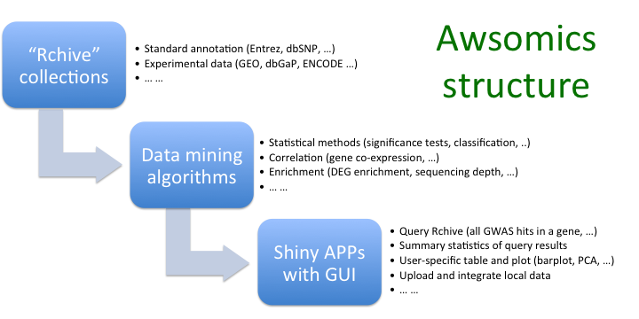

- [What is](#bg)
    - [Awsomics](#bg_aws)
    - [Rchive](#bg_rch)
    - [GeEx](#bg_geex)
- [How to use](#how)
    - 
- [FAQ](#faq)

---

## What is

**What is Awsomics?** Awsomics is an online toolbox that allows biomedical scientists to perform **_exploratory analysis_** of complex genomic data and facilitates **_knowledge discovery_** through their research. It is currently deployed on [Amazon Web Service](http://aws.amazon.com) (AWS), a cloud platform. Awsomics has 3 major components: **_Rchive_**, the backend collection of currated genomic data; a **_Shiny web server_** that hosts a series of bioinformatics tools, or APPs; and implemented **_bioinformatics methods_** enabling integrative analysis of multiple data sets and data types (see Figure).

**What is Rchive?** Rchive is a collection of **_curated_** genomic data stored on the cloud platform. It makes the overwhelming amount of genomic data and information much **_more accessible_** to biomedical researchers. The same type of data goes through the same processing, formatting, and quality control procedures to support **_integrative analysis_**. Any types of genomic data could be included in Rchive, for example,

- Standard annotation: dbSNP, NCBI gene, OMIM, etc.
- Functional categorization: BioSystems, KEGG pathways, Gene Ontology, etc.
- Experimental data and analysis results: GEO, 1000 Genomes, ENCODE, dbGaP, etc.

In addition, users can integrate their own data sets into Rchive, and then analyze them together with public data.

**What is GeEx?**  GeEx provides exploration, visualization, and primary analysis of **_transcriptome data collections_**. Each data collection includes one or more **_data sets_**. Data sets of the same collection could be generated by different labs, technologies or even species, but they should all share a common research topic of interest. For example, the C0001 collection is made of data sets studying primary mitochondrial dysfunctions due to germline mutation, chemical induction, etc. After loading a selected data collection, GeEx provides basic data browsing and visualizing functions for users to explore its contents and identify expression patterns of specific genes or gene sets. Careful **_data curation_** is key to the 

---

## How to use

---

## FAQ

**Q: 
A:

**Q: 
A: 

