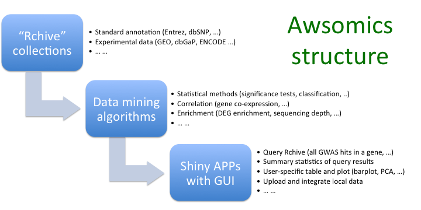
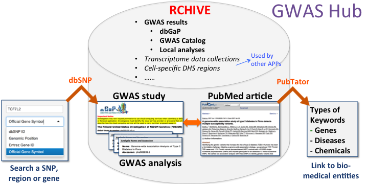
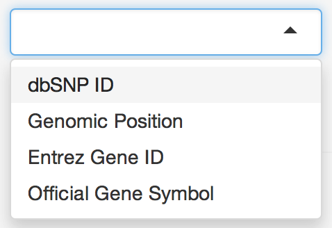

- [What is](#bg)
    - [Awsomics](#bg_aws)
    - [Rchive](#bg_rch)
    - [GWAS Hub](#bg_hub)
- [How to use](#how)
    - [Search](#how_search)
        - [Basic search options](#how_search_basic)
        - [Extra search options](#how_search_extra)
        - [Search results](#how_search_result)
    - [Introduction](#how_intro)
    - [Factoid](#how_fact)
    - [Browse](#how_browse)
    - [Secondary analysis](#how_2nd)
- [FAQ](#faq)

---

## What is

**What is Awsomics?** Awsomics is an online toolbox that allows biomedical scientists to perform **_exploratory analysis_** of complex genomic data and facilitates **_knowledge discovery_** through their research. It is currently deployed on [Amazon Web Service](http://aws.amazon.com) (AWS), a cloud platform. Awsomics has 3 major components: **_Rchive_**, the backend collection of currated genomic data; a **_Shiny web server_** that hosts a series of bioinformatics tools, or APPs; and implemented **_bioinformatics methods_** enabling integrative analysis of multiple data sets and data types (see Figure).

**What is Rchive?** Rchive is a collection of **_curated_** genomic data stored on the cloud platform. It makes the overwhelming amount of genomic data and information much **_more accessible_** to biomedical researchers. The same type of data goes through the same processing, formatting, and quality control procedures to support **_integrative analysis_**. Any types of genomic data could be included in Rchive, for example,

- Standard annotation: dbSNP, NCBI gene, OMIM, etc.
- Functional categorization: BioSystems, KEGG pathways, Gene Ontology, etc.
- Experimental data and analysis results: GEO, 1000 Genomes, ENCODE, dbGaP, etc.

In addition, users can integrate their own data sets into Rchive, and then analyze them together with public data.

**What is GWAS Hub?** GWAS Hub is the first APP of Awsomics. It allows researchers to access and analyze existing GWAS results around their SNP, gene, or genomic loci of interest. GWAS results retrieved from **_multiple studies_** are further summarized and visualized to assist users through an information-to-knowledge process. Based annotation and published papers of these studies, Furthermore, **_enrichment analysis_** can identify diseases, genes, or chemicals that are over-represented in all independent GWAS analyses reported significant results of a SNP or gene. GWAS Hub uses data collected in Rchive (see Figure), which currently and will be continuously expanded with more **_public and local_** GWAS restuls. 

---

## How to use
The top menu of GWAS Hub includes these tabs:

### Search
Users can use this tab to search existing GWAS results and view search results in a sortable table

#### Basic search options

- `dbSNP ID` an official dbSNP ID or its alternative forms, e.g. rs25 (preferred), 25, or RS25. (http://www.ncbi.nlm.nih.gov/SNP)

- `Genomic Position` chromosome name followed by starting and ending position of search region, e.g. 1:1-1000 (preferred), Chr1:1-1000, and 1:1000 (just the 1000th base on chromosome 1). Searching of very large region (>10 million bp) is not encouraged. (https://genome.ucsc.edu)

- `Entrez Gene ID` an official Entrez gene ID, in the form of an integer. (http://www.ncbi.nlm.nih.gov/gene)

- `Official Gene Symbol` an official gene symbol or its formal synonym, e.g. TP53 (preferred), P53, and BCC7. (http://www.genenames.org)

#### Extra search options

- `Extend region` extend searching region at both ends or one ends, in unit of kilobases. This is a useful option when you want to include the upstream and/or downstream regions of a gene or SNP in search results, considering that genetic variants are linked to each other. 

- `Genome version` use GRCh37 (hg19) or GRCh38 (hg38) in research results.

- `Limit search to` limit search to a specific GWAS analysis, study, or database table mapped to the search key. The search key will be first looked up in the metadata (ID, name, title, etc.) to identify analyses mapped to it.

- `Max Phred of analyses` GWAS analyses whose max Phred score is out of the specified range will be excluded from the search. Analyses including no high Phred scores might be severely underpowered and provide mostly noise while analyses reporting extremely high Phred score might indicate strong bias in sample groups. The range should be in the form of 10-300 (limits on both sides); 10- (no up-limit); or -300 (no down-limit). 

- `Exclude database table(s)` the GWAS analyses were grouped into a few database tables (see details in [Factoid](#how_factoid)), due to the heterogenous these analyses. Most of these tables include a number of analyses based on the same data sets. Users can make the search results from different analyses more homogenous by limiting the search to a subset of tables. 

- `Hide p value` mask the p values in search results when users don't want to see the Phred scores in search results. It's an option for preview number of varients in search regions without being biased by extraordinary Phred scores.

- `Clear all` reset search options.

#### Search results

The columns in search result table: 

- `Phred`: GWAS Hub currently only reports Phred scores in any GWAS results. Phred scores are non-negative integers transformed from p values of any statistical test (Fisher, GEE, etc.): **_Phred = round(-Log10(P))_**. So the correspondant Phred scores to p of 1, 0.1, 0.01, 0.001, ... are 0, 10, 20, 30, ...

- `Rank`: The rank of a Phred score in the whole results of a GWAS analysis. When the full result set of an analysis was reported, as in dbGaP, the ranking looks like: `top100; top0.1%`, meaning the Phred score is within both top 100 and top 0.1% of all scores from the analysis. When only top hits of an analysis were reported, as in GWAS Catolog, the ranking looks like: `top7`, meaning it's one of the 7 reported hits.

- `Position`: chromosome:position of the variant.

- `SNP`: dbSNP ID. GWAS Hub currently only reports variants with a dbSNP ID.

- `Analysis`: GWAS analysis ID. It looks like `pha000001` if the analysis is from dbGaP, and `pmid24823311_3` if the analysis is from GWAS Catolog.

- `Study`: GWAS study ID within which the analysis was performed. It looks like `phs000007` if the study is from dbGaP, and `pmid24823311` if the study is from GWAS Catolog.

- `PubMed`: The ID of the representative PubMed that has been associated to the GWAS analysis by the provider of the analysis results.

- `Analysis Name`: Full analysis name.

### Introduction

Background introduction and users' manual of GWAS Hub.

### Factoid

The default page on this tab is a summary of current contents in Rchive that are used by GWAS Hub. Users can also use the search panel to look up details of individual analysis, study, gene, and PubMed article. **_TODO_**: allow to look up individual SNPs 

### Browse

In this tab, Users can review the full metadata tables of:

- `Database table`

- `Study`

- `Analysis`

- `PubMed`

- `Keyword`

- `Gene`

### Secondary analysis

---

## FAQ

**Q: How can I include my own GWAS results in GWAS Hub?**
A:

**Q: Why didn't the enrichment analysis provide any p value?**
A: 

