## _Abstract_

**Background.** Autoimmune disease systemic lupus erythematosus (SLE) has a systematically modified epigenome according to our previous studies on histone modifications such as tri-methylation of histone H3 lysine 4 (H3K4me3). H3K4me3 is a canonical open chromatin mark of active transcription.  Recent studies also suggested that H3K4me3 breadth at transcription start site (TSS) has important regulatory role in cell identity. This project examined H3K4me3 breadth at TSS in primary monocytes and its association with differential gene transcription in SLE. Integrative bioinformatics analysis was applied to ChIP-seq and RNA-seq data generated from the same samples, as well as public genomic data. We created an online application for this project, which also enables users to explore its data and perform their own analysis. [link](http://awsomics.org/project/sle_h3k4me3_breadth)

**Results.** Distinctive H3K4me3 patterns of ChIP-seq peaks were identified from 14,217 TSSs in control monocytes. The narrow peaks are mostly related to housekeeping functions. The broader peaks have extended H3K4me3 at TSS upstream and/or downstream and are often found at immune response genes. Many TSSs have downstream H3K4me3 extended to ~650bp, where H3K36me3, a transcriptional elongation mark, starts to raise. H3K4me3 pattern is strongly associated with gene overexpression in SLE. Genes with narrow peaks were less likely (OR = 0.14) while genes with extended downstream H3K4me3 were more likely (OR = 2.4) to be overexpressed in SLE. Since H3K4me3 levels of nearby regions are correlated to each other, we removed the interdependence of TSS, upstream and downstream regions by fitting a linear model and evaluated the direct correlation between differential transcription and differential H3K4me3 at each region. The downstream region has the strongest association with differential transcription. Of the genes having significant overexpression in SLE (p < 0.01), respectively 78.8%, 55.0% and 47.1% had increased H3K4me3 at their downstream, TSSs and upstream regions. Gene transcription sensitively and consistently responded to downstream H3K4me3 change, as every one percent increase of H3K4me3 led to ~1.5% average increase of transcription. 

**Conclusion.** In summary, we identified TSS downstream as a crucial region responsible for transcription changes in SLE. Given that many genes have the transcriptional initiation-elongation transition in this region, it is plausible to hypothesize that increase of downstream H3K4me3 will facilitate the transition by making the nucleosome more accessible to elongation machinery. This study applied a unique method to study the effect of H3K4me3 breadth on diseases, and revealed new insights about epigenomic modifications in SLE, which can potential lead to novel treatments.  

## Results

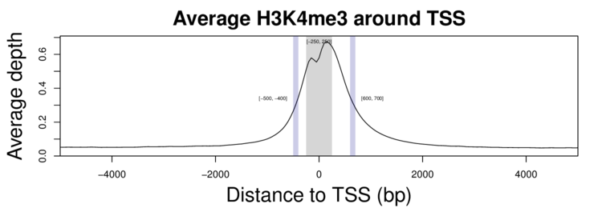

**Figure 1.** Average H3K4me3 peaked within the core promoter regions (-250bp to +250bp around TSS). The average H3K4me3 was reduced by 50% at ~450bp upstream and ~650bp downstream of TSSs. 

  
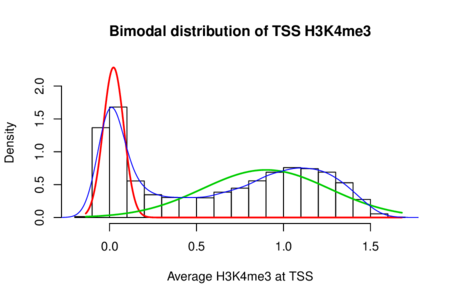 

**Figure 2.** H3K4me3 at all TSSs has a bimodal distribution. The left peak was composed of random values obtained from non-H3K4me3 sites while the right peak corresponds to various levels of H3K4me3 at the other sites. 

  
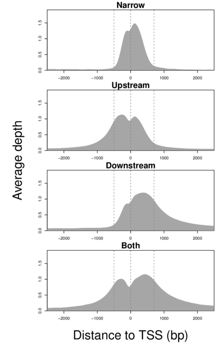

**Figure 3.** Four patterns of H3K4me3 were defined: Narrow Peak, Upstream Extended, Downstream Extended, and Broad Peak.

  
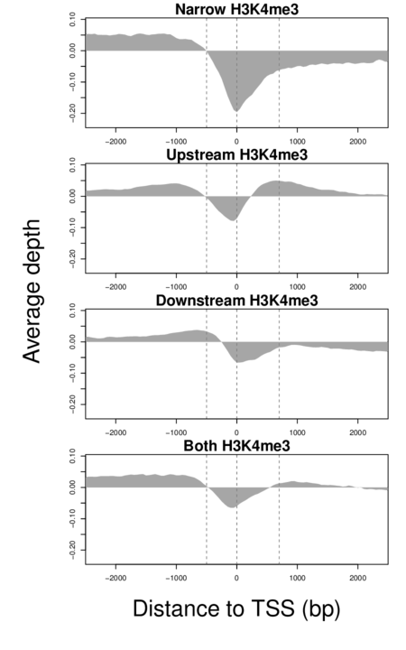 

**Figure 4.** Average depth of H3K27me3 of four H3K4me3 patterns around TSS. The four groups of TSS having different H3K4me3 patterns also showed distintive H3K27me3 patterns. Also suggested is the complex dynamics of histone modifications around TSSs.

  
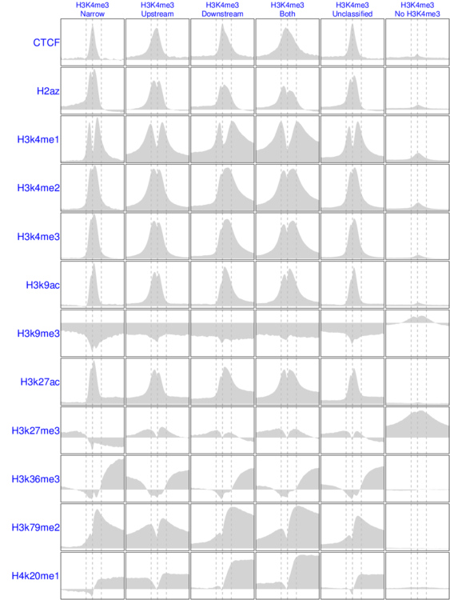

**Figure 5.** Patterns of CTCF and eleven histone marks in ENCODE CD14+ monocyte. TSSs were grouped based on their H3K4me3 patterns obtained above. Sequencing depth of each mark was normalized the same way as this study. All plots in the same row have the same y-axis scale.

  
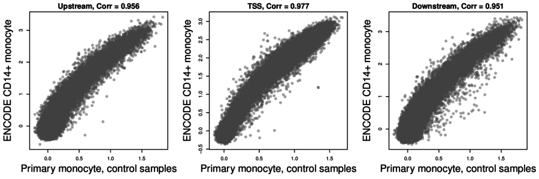 

**Figure 6.** Agreement of H3K4me3 between samples of this study and ENCODE CD14+ monocyte at different regions around TSS. The correlation between samples from two independent studies is similarly strong at three different regions around TSS.  

  
 

**Figure 7.** The association between TSS H3K4me3 patterns and transcription of downstream genes. A). Genes with extended H3K4me3 at downstream of their TSSs had generally higher expression level. B). The same type of genes also had higher between sample variance. To make this plot, the dependence of between-sample variance on gene expression level was removed using the Loess local fitting method. 

  
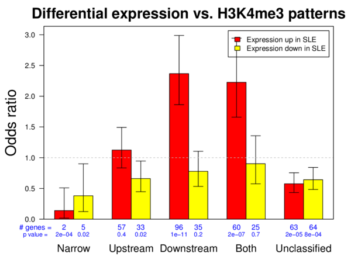

**Figure 8**. The association between differential gene expression in SLE and H3K4me3 patterns. The odd ratios represent the likelihood of genes having differential expression in SLE. 

  
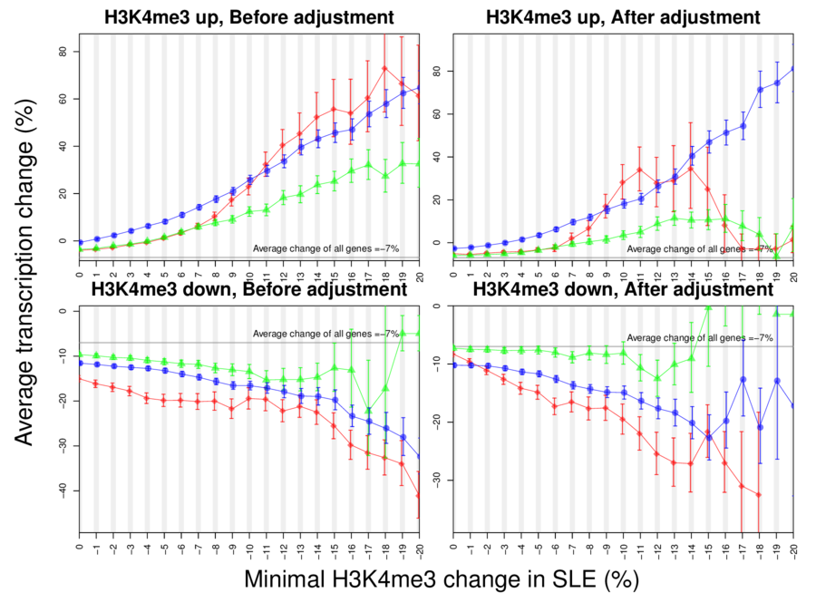

**Figure 9**. The effect of H3K4me3 change around TSS on differential gene expression in SLE. Each plot shows the average change of gene expression in SLE in response to one percent of H3K4me3 change at three different regions. Such association was re-evaluated after removing the dependence of H3K4me3 at these three neighboring regions on each other.

  
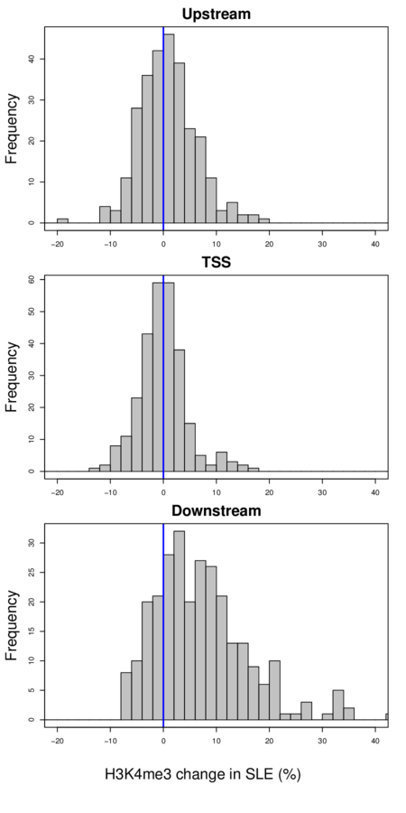

**Figure 10**. H3K4me3 changes of genes with significant increase of expression in SLE. The distribution of H3K4me3 changes at three different regions, of genes with increased expression in SLE.

  
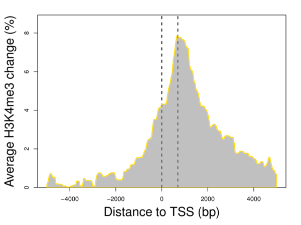

**Figure 11**. Region-specific H3K4me3 change of genes with increased expression in SLE. This plot shows the average H3K4me3 change around 278 TSSs whose downstream genes were significantly increased in SLE.

  
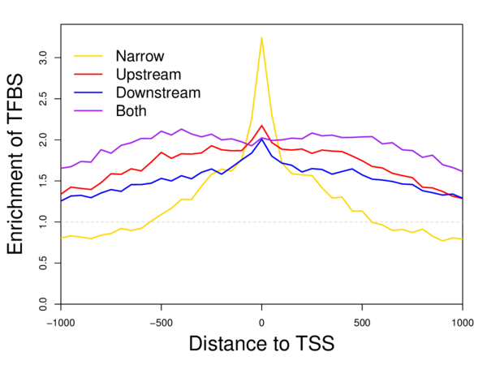

**Figure 12.** Enrichment of TFBSs around TSS corresponding to H3K4me3 patterns. Matches to 2414 known protein-binding motifs were searched around TSSs, which found that 340 motifs were enriched around TSS with H3K4me3 (at least 20% more). The average enrichment of these motifs were plotted separately for each H3K4me3 pattern. The enrichment was spread across a broader region around TSSs with broad H3K4me3 peaks, suggesting that TF binding plays a role in maintaining H3K4me3 broadth. 

  
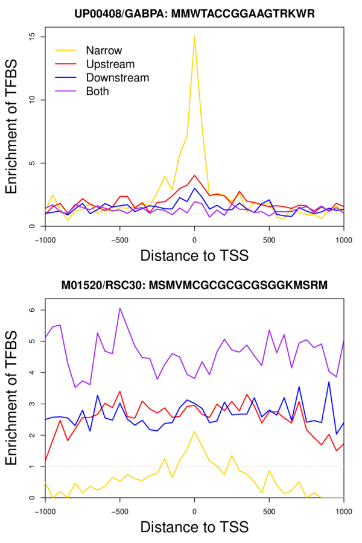

**Figure 13.** TFBS enrichment, examples. The UP00408 motif of GABPA was highly enriched around TSSs with narrow H3K4me3 peaks. On the other hand, the M01520 motif of RSC30, a histone remodeling regulator, was enriched across the neighboring region of TSSs with wide H3K4me3 peak, while the TSSs with narrow peaks had almost no enrichment. These examples confirmed the regulatory role of specific DNA-binding proteins in maintaining H3K4me3 peak breadth.
  
  
[Click](./figures.zip) to download all figures.

_END OF DOCUMENT_
